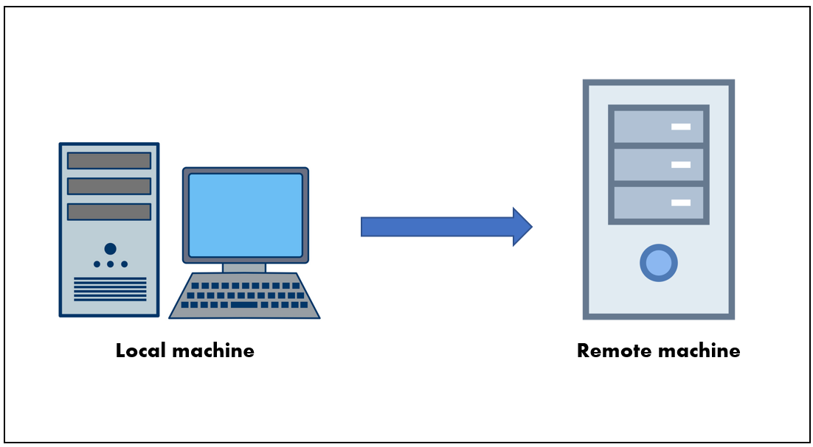
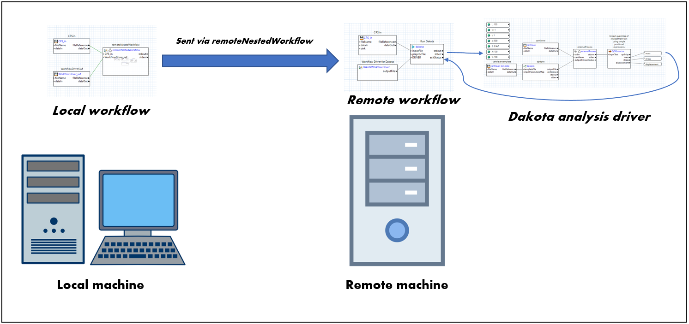
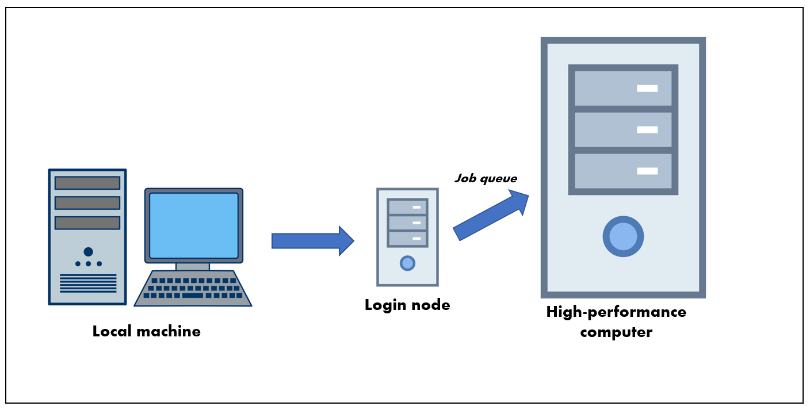
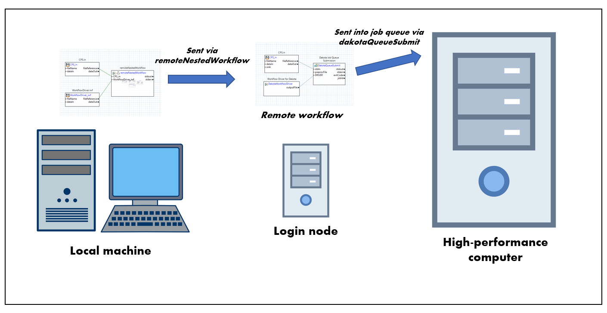

.. _gui-job-submission-overview:

"""""""""""""""""""""""
Job Submission Overview
"""""""""""""""""""""""

There are generally two types of remote machines that you can submit Dakota jobs to: **non-queued machines** and **queued machines.**

.. note::

   In Dakota GUI, the primary means of submitting jobs to remote machines is :ref:`through Next-Gen Workflow <gui-job-submission-workflow>`. As such, the following illustrations
   refer to specific steps you would take in a Next-Gen Workflow job submission approach. :ref:`Click here for information on the legacy Job Submission run configuration dialog. <gui-job-submission-classic>`

-------------------
Non-queued machines
-------------------

As the name implies, non-queued machines have no job queues. They are high-performance machines that you can send Dakota jobs to and run the jobs right away.

   
   Non-queued job submission diagram

For a non-queued remote machine, the basic approach is as follows:
	 

   
   Non-queued job submission diagram, with workflows

1. Create a workflow that will be run locally on your machine, and will include a :ref:`remoteNestedWorkflow <gui-job-submission-workflow-remoteNestedWorkflow>` node, which sends a second workflow to the remote machine.
   The remoteNestedWorkflow node will include configuration for how to connect to the remote machine (the machine name, credentials, etc.)
2. Create a second workflow that will be run on the remote machine. This workflow should perform whatever computation steps are core to your simulation.
   (In the diagram above, the remote workflow is running Dakota with an NGW analysis driver, so this results in a third workflow, which must also be sent to the remote machine,
   but this third workflow is not a prerequisite for a functioning remote workflow.)
3. Finally, run the first workflow on your local machine.

For data collection, you should augment the second workflow to send data back to the first. Refer to the
main :ref:`remoteNestedWorkflow <gui-job-submission-workflow-remoteNestedWorkflow-receivefiles>` section below for more
details on how to do this.

---------------
Queued machines
---------------

   Queued job submission diagram

The approach for submitting to a queued remote machine is somewhat more involved. In the case of queued remote machines, the secondary workflow sent off by the remoteNestedWorkflow node
will arrive at a staging area called **the login node.** This is not the appropriate place to perform the job, especially if the job requires heavy-duty computation. This secondary workflow
sitting on the login node must itself be smart enough to submit work into a **job queue.** The work submitted to the job queue will wait in line with other jobs waiting to use that machine.
Once it is your job's turn, the actual work will be performed, after which the results can be transferred back to your local machine for review.

The overall task is further complicated by the fact that queue submission is typically script-based, which means that the job itself must be governed by a series of shell scripts (instead
of an NGW workflow), so you must be moderately comfortable reading and writing scripts to do queued job submission. However, we have developed a special node
called :ref:`dakotaQueueSubmit <gui-job-submission-workflow-dakotaQueueSubmit>`,  designed to make this step easier.

   Queued job submission diagram, with workflows

To summarize, the basic approach for a queued remote machine is as follows:

1. Create a workflow that will be run locally on your machine, and will include a :ref:`remoteNestedWorkflow <gui-job-submission-workflow-remoteNestedWorkflow>` node, which sends a second workflow
   to the queued machine's login node. The remoteNestedWorkflow node will include configuration for how to connect to the remote machine login node (the machine name, credentials, etc.)
2. Create a second workflow that will be run on the login node of the queued machine, and will include a :ref:`dakotaQueueSubmit <gui-job-submission-workflow-dakotaQueueSubmit>` node. The dakotaQueueSubmit will prepare scripts that will
   be executed once in the job queue.

For data collection, you should augment the second workflow to send data back to the first. Refer to the
main :ref:`remoteNestedWorkflow <gui-job-submission-workflow-remoteNestedWorkflow-receivefiles>` / :ref:`dakotaQueueSubmit <gui-job-submission-workflow-dakotaQueueSubmit-receivingfiles>`
sections below for documentation on how to do this.