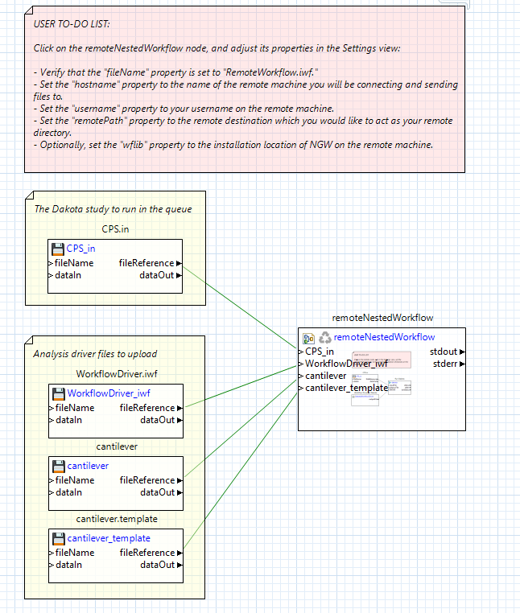
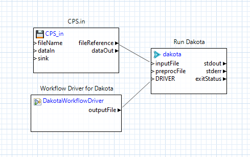

.. _gui-job-submission-workflow:

""""""""""""""""""""""""""""""""""""""""
Job Submission (Using Next-Gen Workflow)
""""""""""""""""""""""""""""""""""""""""

========
Examples
========

.. _gui-job-submission-workflow-example1:

Example 1: NGW+Dakota on a Non-Queued Remote Machine
----------------------------------------------------

For this example, we will be building the set of workflows shown below:

.. figure:: img/JobSubmissionDiagram3.png
   :name: jobsubexample1:figure01
   :alt: Non-queued machine job submission example
   :align: center

   Non-queued machine job submission example

You will need access to at least one remote machine to build this example. You will also need a run-ready Dakota analysis driver. We recommend WorkflowDriver.iwf, available in the example repository
at ``dakota-examples/official/gui/analysis_driver_tutorial/complete_ngw_driver``.

**Step 1.** Construct the local workflow, which will consist of two file nodes and one :ref:`remoteNestedWorkflow <ngw-node-remoteNestedWorkflow>`. Call the workflow something like LocalWorkflow.iwf.

   LocalWorkflow.iwf

The two file nodes will be your Dakota file (CPS.in in :numref:`jobsubexample1:figure02`) and your Dakota analysis driver (WorkflowDriver.iwf in :numref:`jobsubexample1:figure02`).

**Step 2.** Create two input ports on the remoteNestedWorkflow node, and pass the fileReference output port of each file node into the respective input port.

**Step 3.** Click on each connection line and, in the Settings view, set the "File Transfer Behavior" to "Copy file to target." Each connection line should turn green.

**Step 4.** Create your remote nested workflow on your local machine. Call it something like RemoteWorkflow.iwf.

   RemoteWorkflow.iwf
	 
As you can see in :numref:`jobsubexample1:figure03` above, the remote workflow is responsible for starting Dakota. The Dakota node will receive the CPS.in file node (sent from your local machine), and the output from a
dakotaWorkflowDriver node (which itself uses the WorkflowDriver.iwf file, also sent from your local machine).

**Step 5.** Back in the first workflow (LocalWorkflow.iwf), click on the remoteNestedWorkflow to open its properties in the Settings view, and set the "fileName" field to "RemoteWorkflow.iwf".

**Step 6.** Set all relevant information about the remote machine required to log into it (the name of the machine, your username, etc.) This step is intentionally ambiguous because the network setup at your location
will be unique. Contact your system administrator if you need help with this step.

**Step 7.** Run LocalWorkflow.iwf.

That's it! As a follow-up exercise, try retrieving Dakota's output files by adding output ports to the remoteNestedWorkflow, using the approach described :ref:`here <gui-job-submission-workflow-remoteNestedWorkflow-receivefiles>`.

.. _gui-job-submission-workflow-example2:

Example 2: NGW+Dakota on a Queued Machine
-----------------------------------------

For this example, we will be building the set of workflows / scripts shown below:

.. image:: img/JobSubmissionDiagram4.png
     :alt: Non-queued job submission

You will need access to at least one remote machine with a job queue to build this example.

TODO