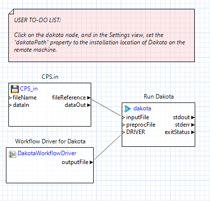
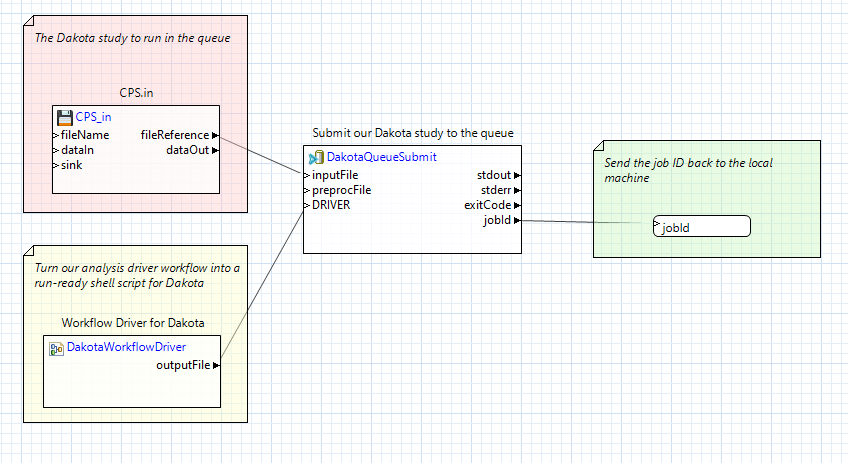

.. _gui-job-submission-workflow:

""""""""""""""""""""""""""""""""""""""""
Job Submission (Using Next-Gen Workflow)
""""""""""""""""""""""""""""""""""""""""

.. _gui-job-submission-workflow-example1:

Example 1: NGW+Dakota on a Non-Queued Remote Machine
----------------------------------------------------

For this example, we will be building the set of workflows shown below:

.. figure:: img/JobSubmissionDiagram3.png
   :name: jobsubexample1:figure01
   :alt: Non-queued machine job submission example
   :align: center

   Non-queued machine job submission example

You will need access to at least one remote machine to build this example. You will also need a run-ready Dakota analysis driver. We recommend WorkflowDriver.iwf, available in the example repository
at ``dakota-examples/official/gui/analysis_driver_tutorial/complete_ngw_driver``.

**Step 1.** Construct the local workflow, which will consist of two file nodes and one :ref:`remoteNestedWorkflow <ngw-node-remoteNestedWorkflow>`. Call the workflow something like LocalWorkflow.iwf.

   LocalWorkflow.iwf

The two file nodes will be your Dakota file (CPS.in in :numref:`jobsubexample1:figure02`) and your Dakota analysis driver (WorkflowDriver.iwf in :numref:`jobsubexample1:figure02`).

**Step 2.** Create two input ports on the remoteNestedWorkflow node, and pass the fileReference output port of each file node into the respective input port.

**Step 3.** Click on each connection line and, in the Settings view, set the "File Transfer Behavior" to "Copy file to target." Each connection line should turn green.

**Step 4.** Create your remote nested workflow on your local machine. Call it something like RemoteWorkflow.iwf.

   RemoteWorkflow.iwf
	 
As you can see in :numref:`jobsubexample1:figure03` above, the remote workflow is responsible for starting Dakota. The Dakota node will receive the CPS.in file node (sent from your local machine), and the output from a
dakotaWorkflowDriver node (which itself uses the WorkflowDriver.iwf file, also sent from your local machine).

**Step 5.** Back in the first workflow (LocalWorkflow.iwf), click on the remoteNestedWorkflow to open its properties in the Settings view, and set the "fileName" field to "RemoteWorkflow.iwf".

**Step 6.** Set all relevant information about the remote machine required to log into it (the name of the machine, your username, etc.) This step is intentionally ambiguous because the network setup at your location
will be unique. Contact your system administrator if you need help with this step.

**Step 7.** Run LocalWorkflow.iwf.

That's it! As a follow-up exercise, try retrieving Dakota's output files by adding output ports to the remoteNestedWorkflow, using the approach described :ref:`here <gui-job-submission-workflow-remoteNestedWorkflow-receivefiles>`.

.. _gui-job-submission-workflow-example2:

Example 2: NGW+Dakota on a Queued Machine (Online Mode)
-------------------------------------------------------

**Online Mode:** Online studies are comparatively simple. Dakota is run once, and the driver waits for submitted jobs to complete. The distinction between single-pass and feedback studies doesn't matter for online studies.

For this example, we will be building the set of workflows / scripts shown below:

.. figure:: img/JobSubmissionDiagram4.png
     :name: jobsubexample2:figure01
     :alt: Queued job submission

You will need access to at least one remote machine with a job queue to build this example.

**Step 1.** Construct the local workflow, which will consist of four file nodes to be uploaded to the remote
machine, and one :ref:`remoteNestedWorkflow <ngw-node-remoteNestedWorkflow>`. Call the workflow something
like LocalWorkflow.iwf.

   LocalWorkflow.iwf
   
The four files nodes will be:

 - Your Dakota input file (``CPS.in`` in :numref:`jobsubexample2:figure02`)
 - Your Dakota analysis driver (``WorkflowDriver.iwf`` in :numref:`jobsubexample2:figure02`).
 - The cantilever simulation model (``cantilever`` in :numref:`jobsubexample2:figure02`).
 - The templatized cantilever input file (``cantilever.template`` in :numref:`jobsubexample2:figure02`).

**Step 2.** Create four input ports on the remoteNestedWorkflow node, and pass the fileReference output port of
each file node into the respective input port.

**Step 3.** Click on each connection line and, in the Settings view, set the "File Transfer Behavior"
to "Copy file to target." Each connection line should turn green.

*Optional Step.* You may wish to create an output port on remoteNestedWorkflow called "jobId" for capturing the
ID of the submitted job. This is not strictly required, but it can be helpful for collecting job data from the
remote machine at a later date.

**Step 4.** Create your second workflow. This is the workflow that will run remotely on the login node of the
high-performance computer. Call this workflow something like LoginNodeWorkflow.iwf.

   LoginNodeWorkflow.iwf
   
This workflow should be configured with a :ref:`dakotaWorkflowDriver <ngw-node-dakotaWorkflowDriver>` node that processes your driver
(``WorkflowDriver.iwf`` from the first workflow). Additionally, you will need a :ref:`dakotaQueueSubmit <ngw-node-dakotaQueueSubmit>` node,
configured as follows:

- Your job submission account ID number should be provided in the "account" field. Talk to your system
  administrator if you need a job submission account ID number.
- Set the number of hours and minutes to provision for your job in the "job.hours" and "job.minutes" fields.
- Set the required number of nodes and processors you need in the "num.nodes" and "num.processors" field.
- Set the type of queue ("batch" is the default for Slurm).

**Step 5.** Back in the first workflow (LocalWorkflow.iwf), click on the remoteNestedWorkflow to open
its properties in the Settings view, and set the "fileName" field to "LoginNodeWorkflow.iwf".

**Step 6.** Set all relevant information about the remote machine required to log into it
(the name of the machine, your username, the remote path to upload files to, etc.) This step is intentionally
ambiguous because the network setup at your location will be unique. Contact your system administrator if
you need help with this step.

**Step 7.** Run LocalWorkflow.iwf.

If this workflow does not work automatically, it is most likely a problem at the shell-scripting level.
You will need to manually diagnose the error by looking at any logs collected on the remote machine, and then
:ref:`make appropriate modifications <gui-job-submission-workflow-dakotaQueueSubmit-scripts>` to the shell
scripts used by the dakotaQueueSubmit node.

.. _gui-job-submission-workflow-example3:

Example 3: NGW+Dakota on a Queued Machine (Offline Mode, Single-Pass)
---------------------------------------------------------------------

**Offline Mode:** Dakota is run twice, the first time to generate parameter sets and launch jobs, and the second to collect results after the jobs have been completed.
It can be advantageous to run studies this way because the simulations may be very long running, and we might not want Dakota the driver instances to remain running on the login node
while they complete. Dakota does not have good built-in support for offline studies.

**Single-Pass Studies:** For this type of method, each driver instance can return dummy results to Dakota to "trick" it to continue running until all the parameter sets have been
emitted (if the driver did not return results, Dakota would abort when it tried to read the results file)

TODO

.. _gui-job-submission-workflow-example4:

Example 4: NGW+Dakota on a Queued Machine (Offline Mode, Feedback)
------------------------------------------------------------------

**Offline Mode:** Dakota is run twice, the first time to generate parameter sets and launch jobs, and the second to collect results after the jobs have been completed.
It can be advantageous to run studies this way because the simulations may be very long running, and we might not want Dakota the driver instances to remain running on the login node
while they complete. Dakota does not have good built-in support for offline studies.

**Feedback Studies:** The simple trick of returning dummy results won't work, because parameters issued by Dakota are determined by the results of earlier evaluations. Here,
the best trick I've found is to use Dakota's batch interface. Dakota writes all the parameters it currently knows out to a batch file. The driver submits jobs for these
parameters, then exits. Dakota aborts. Later, once the results are known, Dakota is run again to collect the (batch) of results, and it issues the next batch, which
contain correct parameter sets.

TODO

.. _gui-job-submission-workflow-example5:

Example 5: NGW+Dakota on a Queued Machine with Resource Tiling
--------------------------------------------------------------

Better when many small to medium size sim jobs.

1. First request a sbatch allocation on HPC
2. Within that allocation, run Dakota on the 0-th 16-core node
3. Dakota dispatches 4 concurrent simulation runs, tiling them within the 32 core allocaiton, e.g.,

   .. code-block::
      
      mpitile -n 8 sierra.exe foo.in
      # where mpitile is a python script wrapper around mpirun/mpiexec shipped with Dakota and in our modules
      # mpitile applicability is very limited, and Adam will investigate whether/when it is still needed.

4. Crucial that the overall allocation size, eval concurrency, and simulation mpi procs be synced up.
5. Dakota runs in serial, with an interface eval_concurrency = 4, smarts are in the analysis driver.

TODO
