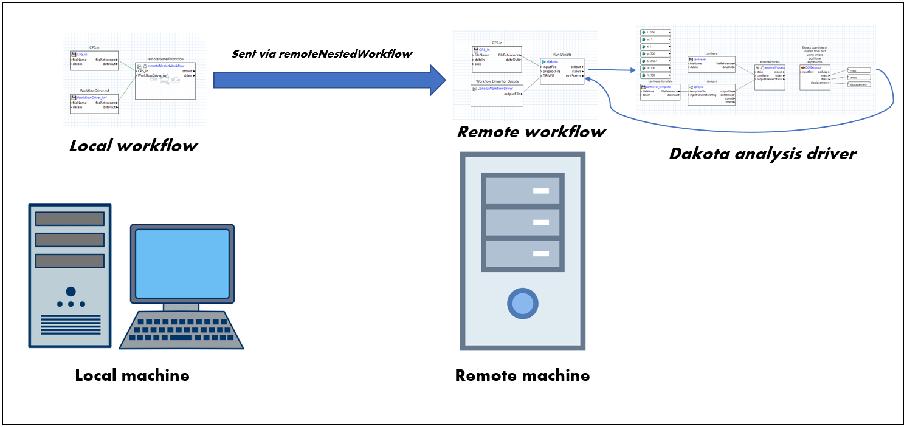

.. _gui-job-submission-workflow:

""""""""""""""""""""""""""""""""""""""""
Job Submission (Using Next-Gen Workflow)
""""""""""""""""""""""""""""""""""""""""

.. _gui-job-submission-workflow-example1:

Example 1: NGW+Dakota on a Non-Queued Remote Machine
----------------------------------------------------

   Non-queued machine job submission example

We recommend checking out the example available in the :ref:`examples repository <gui-examples-online>` at ``dakota-examples/official\gui\job_submission\non_queued_machine_examples\ngw_example``. Follow
the setup steps listed in the associated README to configure the workflows for your unique environment.

.. _gui-job-submission-workflow-example2:

Example 2: NGW+Dakota on a Queued Machine (Online Mode)
-------------------------------------------------------

.. note::

   A Dakota workflow is said to be in **"Online Mode"** if Dakota is run once, and the driver waits for submitted jobs to complete.

.. figure:: img/JobSubmissionDiagram4.png
     :name: jobsubexample2:figure01
     :alt: Queued job submission

We recommend checking out the example available in the :ref:`examples repository <gui-examples-online>` at ``dakota-examples/official\gui\job_submission\queued_machine_examples\ngw_example``. Follow
the setup steps listed in the associated README to configure the workflows for your unique environment.