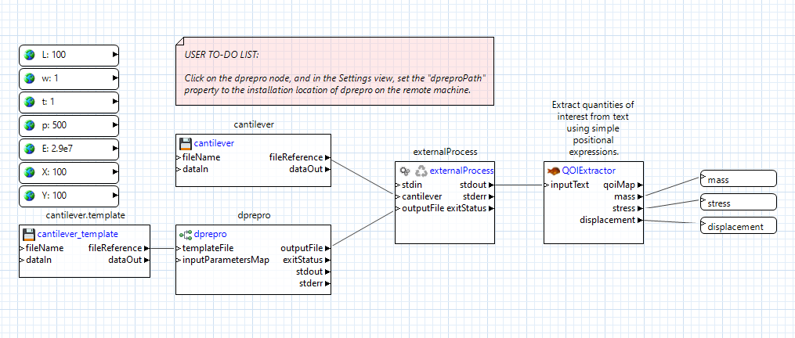

.. _gui-job-submission-workflow:

""""""""""""""""""""""""""""""""""""""""
Job Submission (Using Next-Gen Workflow)
""""""""""""""""""""""""""""""""""""""""

.. _gui-job-submission-workflow-example1:

Example 1: NGW+Dakota on a Non-Queued Remote Machine
----------------------------------------------------

For this example, we will be building the set of workflows shown below:

.. figure:: img/JobSubmissionDiagram3.png
   :name: jobsubexample1:figure01
   :alt: Non-queued machine job submission example
   :align: center

   Non-queued machine job submission example

You will need access to at least one remote machine to build this example. You will also need a run-ready Dakota analysis driver.
We recommend WorkflowDriver.iwf, available in the :ref:`examples repository <gui-examples-online>` at ``dakota-examples/official/gui/analysis_driver_tutorial/complete_ngw_driver``.

**Step 1.** Construct the local workflow, which will consist of two file nodes and one :ref:`remoteNestedWorkflow <ngw-node-remoteNestedWorkflow>`. Call the workflow something like LocalWorkflow.iwf.

.. figure:: img/JobSubmission_NGW_Example1_1.png
   :name: jobsubexample1:figure02
   :alt: LocalWorkflow.iwf
   :align: center

   LocalWorkflow.iwf

The two file nodes will be your Dakota file (CPS.in in :numref:`jobsubexample1:figure02`) and your Dakota analysis driver (WorkflowDriver.iwf in :numref:`jobsubexample1:figure02`).

**Step 2.** Create two input ports on the remoteNestedWorkflow node, and pass the fileReference output port of each file node into the respective input port.

**Step 3.** Click on each connection line and, in the Settings view, set the "File Transfer Behavior" to "Copy file to target." Each connection line should turn green.

**Step 4.** Create your remote nested workflow on your local machine. Call it something like RemoteWorkflow.iwf.

.. figure:: img/JobSubmission_NGW_Example1_2.png
   :name: jobsubexample1:figure03
   :alt: RemoteWorkflow.iwf
   :align: center

   RemoteWorkflow.iwf
	 
As you can see in :numref:`jobsubexample1:figure03` above, the remote workflow is responsible for starting Dakota. The Dakota node will receive the CPS.in file node (sent from your local machine), and the output from a
dakotaWorkflowDriver node (which itself uses the WorkflowDriver.iwf file, also sent from your local machine).

**Step 5.** Back in the first workflow (LocalWorkflow.iwf), click on the remoteNestedWorkflow to open its properties in the Settings view, and set the "fileName" field to "RemoteWorkflow.iwf".

**Step 6.** Set all relevant information about the remote machine required to log into it (the name of the machine, your username, etc.) This step is intentionally ambiguous because the network setup at your location
will be unique. Contact your system administrator if you need help with this step.

**Step 7.** Run LocalWorkflow.iwf.

That's it! As a follow-up exercise, try retrieving Dakota's output files by adding output ports to the remoteNestedWorkflow, using the approach described :ref:`here <gui-job-submission-workflow-remoteNestedWorkflow-receivefiles>`.

.. _gui-job-submission-workflow-example2:

Example 2: NGW+Dakota on a Queued Machine (Online Mode)
-------------------------------------------------------

**Online Mode:** Online studies are comparatively simple. Dakota is run once, and the driver waits for submitted jobs to complete. The distinction between single-pass and feedback studies doesn't matter for online studies.

For this example, we will be building the set of workflows / scripts shown below:

.. figure:: img/JobSubmissionDiagram4.png
     :name: jobsubexample2:figure01
     :alt: Queued job submission

You will need access to at least one remote machine with a job queue to build this example.

You will also need a run-ready Dakota analysis driver. We recommend WorkflowDriver.iwf, available in the :ref:`examples repository <gui-examples-online>`
at ``dakota-examples/official/gui/analysis_driver_tutorial/complete_ngw_driver``.

**Step 1.** Construct the local workflow, which will consist of four file nodes to be uploaded to the remote
machine, and one :ref:`remoteNestedWorkflow <ngw-node-remoteNestedWorkflow>`. Call the workflow something
like LocalWorkflow.iwf.

.. figure:: img/JobSubmission_NGW_Example2_3.png
   :name: jobsubexample2:figure02
   :alt: LocalWorkflow.iwf
   :align: center

   LocalWorkflow.iwf
   
The four files nodes will be:

 - Your Dakota input file (``CPS.in`` in :numref:`jobsubexample2:figure02`)
 - Your Dakota analysis driver (``WorkflowDriver.iwf`` in :numref:`jobsubexample2:figure02`).
 - The cantilever simulation model (``cantilever`` in :numref:`jobsubexample2:figure02`).
 - The templatized cantilever input file (``cantilever.template`` in :numref:`jobsubexample2:figure02`).

**Step 2.** Create four input ports on the remoteNestedWorkflow node, and pass the fileReference output port of
each file node into the respective input port.

**Step 3.** Click on each connection line and, in the Settings view, set the "File Transfer Behavior"
to "Copy file to target." Each connection line should turn green.

*Optional Step.* You may wish to create an output port on remoteNestedWorkflow called "jobId" for capturing the
ID of the submitted job. This is not strictly required, but it can be helpful for collecting job data from the
remote machine at a later date.

**Step 4.** Create your second workflow. This is the workflow that will run remotely on the login node of the
high-performance computer. Call this workflow something like LoginNodeWorkflow.iwf.

.. figure:: img/JobSubmission_NGW_Example2_2.png
   :name: jobsubexample2:figure03
   :alt: LoginNodeWorkflow.iwf
   :align: center

   LoginNodeWorkflow.iwf
   
This workflow should be configured with a :ref:`dakotaWorkflowDriver <ngw-node-dakotaWorkflowDriver>` node that processes your driver
(``WorkflowDriver.iwf`` from the first workflow). Additionally, you will need a :ref:`dakotaQueueSubmit <ngw-node-dakotaQueueSubmit>` node,
configured as follows:

- Your job submission account ID number should be provided in the "account" field. Talk to your system
  administrator if you need a job submission account ID number.
- Set the number of hours and minutes to provision for your job in the "job.hours" and "job.minutes" fields.
- Set the required number of nodes and processors you need in the "num.nodes" and "num.processors" field.
- Set the type of queue ("batch" is the default for Slurm).

**Step 5.** Back in the first workflow (LocalWorkflow.iwf), click on the remoteNestedWorkflow to open
its properties in the Settings view, and set the "fileName" field to "LoginNodeWorkflow.iwf".

**Step 6.** Set all relevant information about the remote machine required to log into it
(the name of the machine, your username, the remote path to upload files to, etc.) This step is intentionally
ambiguous because the network setup at your location will be unique. Contact your system administrator if
you need help with this step.

**Step 7.** Run LocalWorkflow.iwf.

If this workflow does not work automatically, it is most likely a problem at the shell-scripting level.
You will need to manually diagnose the error by looking at any logs collected on the remote machine, and then
:ref:`make appropriate modifications <ngw-queue-scripts>` to the shell scripts used by the dakotaQueueSubmit node.

.. _gui-job-submission-workflow-example3:

Example 3: NGW+Dakota on a Queued Machine (Offline Mode, Single-Pass)
---------------------------------------------------------------------

We will now describe a situation where you would like Dakota to *asynchronously dispatch evaluations, where each evaluation is run inside its own queued job.*
We refer to this use case as "Offline Mode, Single-Pass." Let's define those terms:

**Offline Mode:** Dakota is run *at least* twice. The first time, Dakota will generate parameter sets and launch jobs. On subsequent runs, Dakota will collect results after the jobs
have been completed. It can be advantageous to run studies this way because the simulations may be very long running, and we might not want Dakota the driver instances to remain running on the login node
while they complete. Dakota does not have good built-in support for offline studies.

**Single-Pass Studies:** For this type of method, each driver instance can return dummy results (such as ``NaN``) to Dakota to "trick" it to continue running until all the parameter sets have been
emitted (if the driver did not return results, Dakota would abort when it tried to read the results file)

This use case is achievable thanks to the :ref:`dispatchAndCollect node <ngw-node-dispatchAndCollect>` made available in Next-Gen Workflow. The dispatchAndCollect node is designed to
launch a queued job and then immediately return with the "dummy" value of ``NaN``. Once a job id has been acquied, however, subsequently re-running this node will cause it to use its previously-acquired
job id to check on the job status in the queue. If the job has completed, this node will retrieve the calculated value and return it to the rest of the workflow. Otherwise, the node will output ``NaN``,
and optionally provide the job status for further triaging.

The workflow setup here is more complex than the previous two examples. For this situation, we will need at least **four** workflows:

1. A workflow that runs locally on our machine and sends data to the login node of the remote machine
2. A workflow that runs on the login node and launches Dakota (note that we will use a regular :ref:`dakota node <ngw-node-dakota>`, NOT a dakotaQueueSubmit node, since queue submission is deferred to a later workflow).
3. A workflow that is responsible for dispatching (and/or collecting) data asynchronously. This workflow will make use of the dispatchAndCollect node, and will be recognized by Dakota as the analysis driver.
4. Finally, a workflow that will run inside the job queue and actually perform the relevant calculations. This is the workflow that will be dispatched by the dispatchAndCollect node.

:numref:`jobsubexample3:diagram` somewhat describes this four-level workflow setup. The workflows labeled with numbered green circles correspond to the four workflows described above.

   Offline Mode, Single-Pass example
   
After the initial run (i.e. the first "dispatch"), this set of workflows should be re-run as many times as necessary to check on each evaluation's job status and collect the results of finished jobs.

.. warning::

   Perhaps it goes without saying, but this particular workflow setup relies on holding onto data from previous runs (otherwise, we would not be able to come back and check job status based on
   any previously-acquired job IDs). Therefore, both Dakota and Next-Gen Workflow should be configured to keep data from previous runs, rather than clearing out work directories at the start of
   subsequent runs. Specific steps for setting this up will be described below.
   
You will need access to at least one remote machine to build this example. You will also need a run-ready Dakota analysis driver.
We recommend WorkflowDriver.iwf, available in the :ref:`examples repository <gui-examples-online>` at ``dakota-examples/official/gui/analysis_driver_tutorial/complete_ngw_driver``.   
   
**Step 1.** Construct the local workflow, which will consist of five file nodes to be uploaded to the remote
machine, and one :ref:`remoteNestedWorkflow <ngw-node-remoteNestedWorkflow>`. Call the workflow something
like LocalWorkflow.iwf.

   LocalWorkflow.iwf
   
The four files nodes will be:

 - Your Dakota input file (``dakota_pstudy.in`` in :numref:`jobsubexample3:figure01`)
 - The workflow Dakota will use as its analysis driver (``DispatchAndCollectDriver.iwf`` in :numref:`jobsubexample3:figure01`).
 - The workflow that will actually perform the work in the job queue (``DispatchedInnerWorkflow.iwf`` in :numref:`jobsubexample3:figure01`).
 - The cantilever simulation model (``cantilever`` in :numref:`jobsubexample3:figure01`).
 - The templatized cantilever input file (``cantilever.template`` in :numref:`jobsubexample3:figure01`).

**Step 2.** Create five input ports on the remoteNestedWorkflow node, and pass the fileReference output port of
each file node into the respective input port.

**Step 3.** Click on each connection line and, in the Settings view, set the "File Transfer Behavior"
to "Copy file to target." Each connection line should turn green.

**Step 4.** Create your second workflow. This is the workflow that will run remotely on the login node of the
high-performance computer, and will launch Dakota. Call this workflow something like LoginNodeWorkflow.iwf.

   LoginNodeWorkflow.iwf
   
This workflow should be configured with a :ref:`dakotaWorkflowDriver <ngw-node-dakotaWorkflowDriver>` node that processes your driver
(``DispatchAndCollectDriver.iwf`` from the first workflow). Additionally, you will need a :ref:`dakota <ngw-node-dakota>` node,
which receives your Dakota input file (originally sent from your local machine) and the output from the dakotaWorkflowDriver node,
as pictured in :numref:`jobsubexample3:figure02`.

**Step 5.** Design your DispatchAndCollectDriver.iwf workflow. TODO

   DispatchAndCollectDriver.iwf

**Step 6.** Design your DispatchedInnerWorkflow.iwf workflow. TODO

   DispatchedInnerWorkflow.iwf

**Step 7.** Back in the first workflow (LocalWorkflow.iwf), click on the remoteNestedWorkflow to open
its properties in the Settings view, and set the "fileName" field to "LoginNodeWorkflow.iwf".

**Step 8.** Set all relevant information about the remote machine required to log into it
(the name of the machine, your username, the remote path to upload files to, etc.) This step is intentionally
ambiguous because the network setup at your location will be unique. Contact your system administrator if
you need help with this step.

**Step 9.** Run LocalWorkflow.iwf.