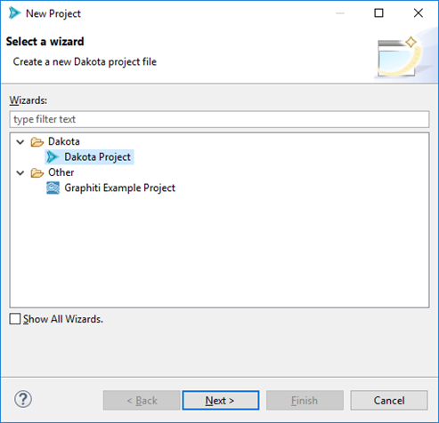

.. _gui-wizards-newdakotaproject-main:

""""""""""""""""""
New Dakota Project
""""""""""""""""""

You can create a new Dakota :ref:`project <gui-eclipse-projects>` using the Dakota Project wizard.

Go to File > New > Project, then select Dakota > Dakota Project from the available options:

==================================
Page 1 (Create New Dakota Project)
==================================

.. image:: img/GettingStarted_NewDakotaProject_4.png
   :alt: Create New Dakota Project

On the first page, put the name of your new project in the "Project name" field.

At this point, you may either choose to click Finish, or proceed to the optional second page to
import a Dakota example into your new project.

==============================
Page 2 (Import Dakota Example)
==============================

.. image:: img/GettingStarted_NewDakotaProject_5.png
   :alt: Import Dakota Example
   
The second page of this wizard allows you to import a fresh Dakota example from the examples repository
into your new project.

.. note::

   Depending on whether your version of Dakota GUI is configured to access
   :ref:`the Dakota team's online repository <gui-examples-online>`
   or :ref:`the set of offline examples shipped with Dakota <gui-examples-offline>`,
   the controls on this page will look slightly different. Please see the documentation on
   :ref:`Dakota Examples <gui-examples-offline>` for more information.