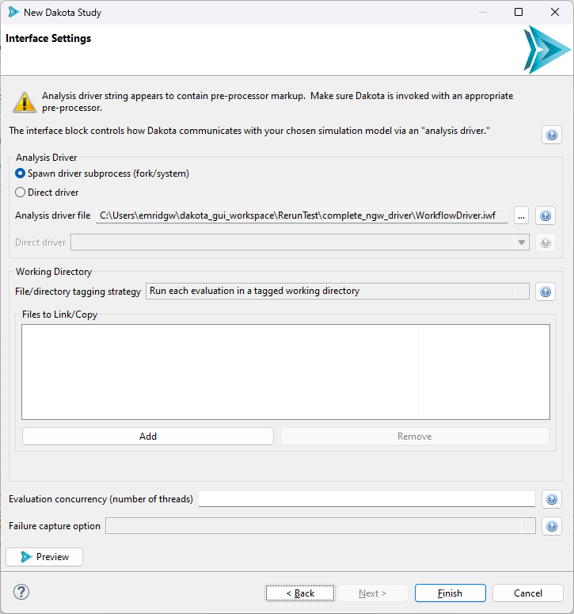

.. _wizards-newdakotastudy:

""""""""""""""""
New Dakota Study
""""""""""""""""

The New Dakota Study wizard allows you to wrap an existing, parameterized simulation model with a Dakota study.  This wizard is ideal for new Dakota users who are not familiar
with Dakota input file syntax, but would like to have a new Dakota study up and running with minimal effort.

.. _wizards-newdakotastudy-prereqs:

That being said, this wizard is usually not the first step for a new Dakota study.  There are two prerequisites to using this wizard.  You will need:

- A parameterized simulation model that can be recognized as having variables and responses.  We recommend either
  using a :ref:`simple text file containing input parameter values <gui-simulation-models-ini-json-yaml>`
  or a :ref:`Next-Gen Workflow file that wraps an external simulation model. <gui-nestedworkflowtutorial-main>`
- An interface for Dakota to communicate with the simulation model.  We recommend either using
  a :ref:`Next-Gen Workflow file that wraps an external simulation model. <gui-nestedworkflowtutorial-main>`
  
You can open this wizard via "File > New > Dakota Study".

===================================
Page 1 (Dakota Study File Creation)
===================================

.. image:: img/NewDakotaStudy_Wizard_1.png
   :alt: File creation page

On the first page, simply choose a file name and location for your new Dakota study.

=======================================
Page 2 (Import Variables and Responses)
=======================================

.. image:: img/NewDakotaStudy_Wizard_2.png
   :alt: Import variables and responses page

Select the file that will provide variable and response information to the wizard.  This file is the :ref:`first of the two prerequisites <wizards-newdakotastudy-prereqs>` mentioned in the introduction.

.. image:: img/NewDakotaStudy_Wizard_3.png
   :alt: Imported variables and responses

.. note::
   Some file types (such as :ref:`IWF workflow files <ngw-main>`) are "one-stop shops" for the Dakota Study wizard.  They can provide variable and response
   information on this "Import Variables and Responses" page of the wizard, but can also provide information as to how Dakota should interface with the IWF
   file (the last page of the wizard).

**The Preview Button**

From the "Method Settings" page onward, you’ll notice a "Preview" button in the bottom-left corner of the wizard.  Hit this button at any moment to pop up another
dialog that shows a preview of the Dakota study, so that you can observe how your Dakota study is coming along as you go through this wizard.

========================
Page 3 (Method Settings)
========================

.. image:: img/NewDakotaStudy_Wizard_4.png
   :alt: Method page

Because Dakota is home to a large number of methods for different types of studies, providing a comprehensive list of methods on this page
would not be helpful.  Instead, this page of the wizard guides you to a method recommendation based on how you answer a series of questions.
For example, if you choose "Basic Parameter Sweep" in the first dropdown, you will be presented with a subsequent dropdown:

.. image:: img/NewDakotaStudy_Wizard_5.png
   :alt: Method page with a chosen method

In response to your choice of "Basic Parameter Sweep", the wizard recommends three related methods –
:ref:`centered_parameter_study <method-centered_parameter_study>`,
:ref:`vector_parameter_study <method-vector_parameter_study>`, and
:ref:`multidim_parameter_study <method-multidim_parameter_study>`, – each of which takes a slightly
different approach to executing a parameter sweep of your problem.

At this juncture, you can hit the "?" button to open the Dakota reference manual and find out more about your chosen method.

==========================
Page 4 (Variable Settings)
==========================

.. image:: img/NewDakotaStudy_Wizard_6.png
   :alt: Variables page

The variables page allows you to configure the variables of your Dakota study.  There is a lot packed onto this page, so let’s go through it one section at a time.

First of all, notice the table.  It is auto-populated with variables from your chosen source of variables and responses.

- **Selection Column**  By default, each imported variable is selected.  Sometimes, we only want to provide Dakota with a subset that represents the variables we’re interested in.  To de-select
  an individual variable, simply click on the green checkmark.  To select it again, click on the red X.
- **Lock Column** The lock icon indicates that a given variable was imported from another simulation model, and thus its label cannot be changed.  However, you are free to add extra
  Dakota variables using the "Add New Variable" button.  These will not have the same lock icon, indicating that they can be re-labeled or deleted.
- **Variable Column** This column shows the variable name imported from the simulation model file, as well as the names of any user-defined variables.  Only user-added variables have editable names.
- **Category Column** Clicking in a cell in this column will provide you with a dropdown containing categories for your variables.  Categorizing variables is a required step for
  building a Dakota study.  Note that this dropdown list only contains variable categories that are appropriate for the type of study you chose to perform back on the Method Settings page.

Let’s also take a look at the button bar…

.. image:: img/NewDakotaStudy_Wizard_7.png
   :alt: Variable table button bar

From left to right…

- **Add New Variable** This button allows you to add your own user-defined variables to the Dakota study.  This can be handy in the case where you’re building your Dakota
  study without a prior source of variables and responses.  It's not recommended if you want your new Dakota study to adhere closely to an existing simulation model.  On
  the other hand, if you know for a fact that your Dakota-to-simulation-model workflow can handle user-defined variables, go ahead and create them here.
- **Edit Variable** After a variable has been assigned to a category (for instance, continuous_design), use the Edit button to configure properties on that variable.
- **Remove Variable** Delete a variable from the variables page.  You can only delete user-created variables; you cannot delete imported variables.
- **Variable Ordering within Category** Dakota variables are ordered first by *variable category* (sometimes referred to as "spec order"), and then by user-customized
  ordering within that category.  This button allows you to configure the latter.
- **Enable All** Batch-enable all your variables.
- **Disable All** Batch-disable all your variables.
- **Reset to Model Defaults** This reverts all your work on the variables page back to the state when you first imported from your source of variables and responses.
  A warning dialog appears when you hit this button (in case you click on it by mistake).
- **Open Dakota Manual** Opens the Dakota manual for the selected variable category (for instance, :ref:`continuous_design <variables-continuous_design>`).
- **Batch-assign category** Auto-assign every variable to the same category.

**Variable Properties**

After assigning a variable to a category (such as :ref:`continuous_design <variables-continuous_design>`), we can further assign specific properties on that variable.  To
do this, click on the variable in the table, then click on the Edit Variable button (the second button from the left).

.. image:: img/NewDakotaStudy_Wizard_8.png
   :alt: Variable property editor dialog

A new dialog will pop up that allows you to edit each possible property for that variable category.  Help buttons are provided for each property so that you can read up on what each one does.

==========================
Page 5 (Response Settings)
==========================

.. image:: img/NewDakotaStudy_Wizard_9.png
   :alt: Responses page

The response settings page is a mirror of the variable settings page, with a few key differences:

- **Response Type**  Dakota responses have a global category of either :ref:`response_functions <responses-response_functions>`,
  :ref:`calibration_terms <responses-calibration_terms>`, or
  :ref:`objective\_functions <responses-objective_functions>`.
- **Gradients**  Use this dropdown to select a :ref:`gradient setting for your study. <responses-no_gradients>`
- **Hessians** Use this dropdown to select a :ref:`hessian setting for your study. <responses-no_hessians>`

===========================
Page 6 (Interface Settings)
===========================

The final page of the wizard is concerned with configuring Dakota's interface block.

- **Analysis Driver Selection** Use this file selector to select an analysis driver for Dakota.  If
  you :ref:`created a nested workflow <gui-nestedworkflowtutorial-main>`, select the .iwf file.  After selecting, hit the
  Preview button to see that the Dakota Study wizard has automatically figured out the correct settings for the interface block based on
  our analysis driver type.
- **Evaluation concurrency (number of threads)** Use this option to configure how multithreaded you want Dakota to be.
- **Analysis Driver Parameter/Result File Options** Using the first two checkboxes, you can configure whether Dakota should keep the parameter/results files for
  each evaluation, and whether each file should be tagged with a number indicating the evaluation.
  
  - Consult :ref:`this section <couplingtosimulations-paramformat>` for more information on the format Dakota uses for parameters and results when communicating with an external analysis driver. 

- **Working Directory Options** Finally, you can also configure whether Dakota's analysis driver should run in a private working directory for each evaluation, and whether
  those working directories should similarly be tagged and saved after each evaluation completes.
  
==========
Next Steps
==========

If you used an .iwf file as your analysis driver, learn about :ref:`the final step <ngw-analysisdrivers-sandwich>` required to run your Dakota Study using Next-Gen Workflow.