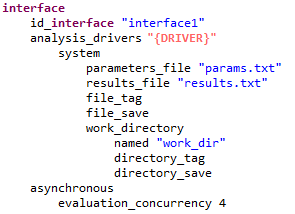
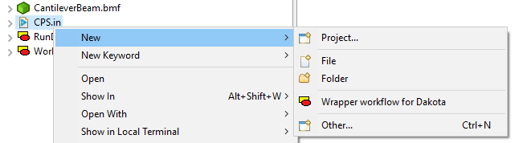
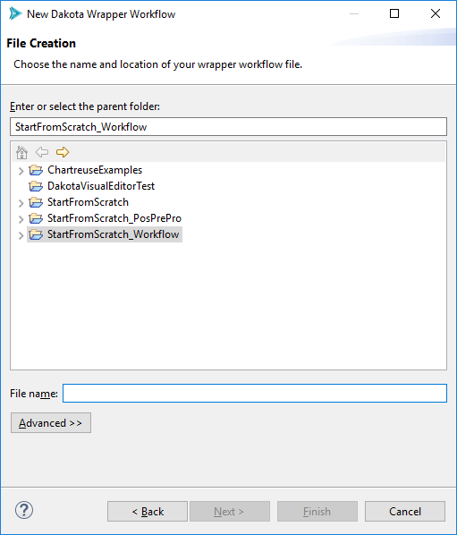
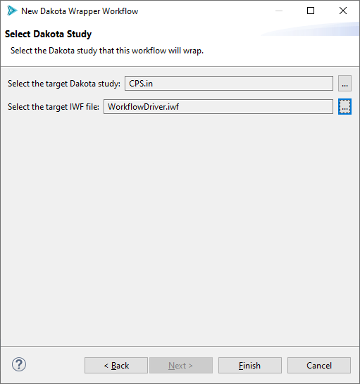
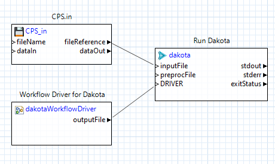

.. _wizards-newwrapperworkflow-main:

"""""""""""""""""""""""""""
New Dakota Wrapper Workflow
"""""""""""""""""""""""""""

=======
Context
=======

The "New Dakota Wrapper Workflow" wizard allows you to easily create a secondary workflow that launches Dakota for you.

"Why would I want to create a workflow that does nothing but execute Dakota?" you may be asking yourself.

A Dakota study that was created using the :ref:`New Dakota Study wizard <wizards-newdakotastudy>` and set up to interface with a
:ref:`Next-Gen Workflow IWF file as the analysis driver <gui-nestedworkflowtutorial-main>` will have an interface block that looks
something like this:

Note that the value for the :ref:`analysis_drivers <interface-analysis_drivers>` keyword is DPREPRO markup.  This means that the Dakota study will not run by itself.
Executing ``dakota -input my_cool_input_file.in`` on the command line won't work for this input file, and neither will using an Eclipse run configuration.

We need a tool that has enough context to appropriately substitute the DPREPRO markup with the correct IWF file as an analysis driver.

For this situation, we need to create a **second wrapper workflow** that launches Dakota for us.  This is the right solution because the "dakota" node in Next-Gen Workflow
knows how to substitute DPREPRO markup.  Additionally, Next-Gen Workflow also provides a special node that converts IWF workflow files into run-ready Dakota analysis drivers.

.. note::

   - In lieu of using this wizard, you can alternately use the :ref:`"Dakota (Workflow)" run configuration <gui-run-configurations-workflow>` to launch Dakota in an NGW context.
     This is sometimes faster than using the "New Dakota Wrapper Workflow" wizard.
   - You can read more about the relationship between Dakota analysis drivers and Next-Gen Workflow :ref:`here <ngw-analysisdrivers>`.
   
===============
Wizard Overview
===============

To access this wizard:

- Go to "File > New > Other" and then "Dakota > Dakota Wrapper Workflow".  
- You can also right-click on a Dakota input file and choose "New > Wrapper workflow for Dakota".

This wizard is extremely short.  On the first page, choose a name and location for your wrapper workflow (a common convention is to call it "RunDakota.iwf")

On the second and final page of the wizard, use the file selector control to select your target Dakota input file.  If you used the context menu option for launching the wizard, this field will already be populated.

There is an additional set of fields below, which represent pre-processing markup parsed out of the Dakota input file. In the case of a Dakota study with an NGW analysis driver, you
will typically only see one piece of pre-processing markup to fill out - "DRIVER." You can either use the ellipsis button to the right to choose your NGW analysis driver file, or simply type in the path to the NGW analysis driver.

Note that all DPREPRO-compatible markup will be recognized, potentially leading to multiple fields on this page.

Hitting Finish will generate a run-ready workflow that executes your Dakota study in concert with your chosen IWF file as the analysis driver (via the dakotaWorkflowDriver node):

