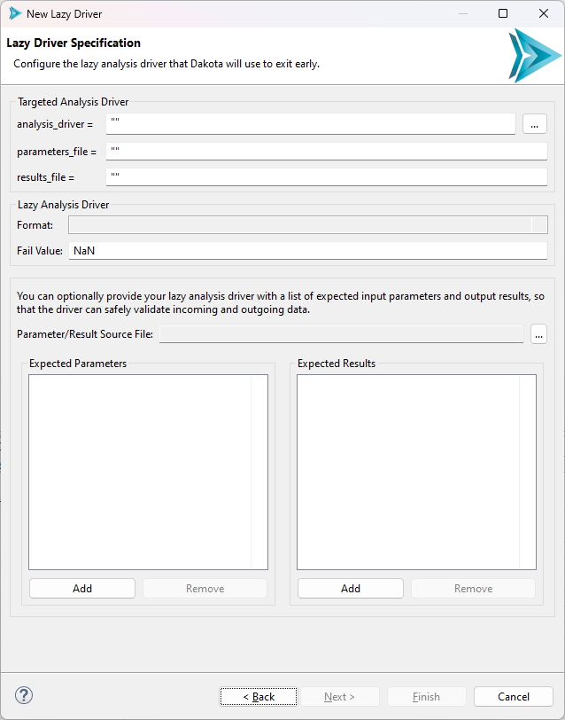
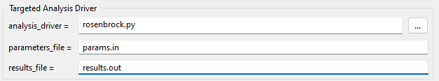

.. _wizards-newlazydriver-main:

"""""""""""""""""
New "Lazy" Driver
"""""""""""""""""

============
Lazy Drivers
============

The concept behind a lazy driver is to allow Dakota to "set and forget" its individual evaluations.

- A lazy driver performs no calculations of its own, but simply wraps itself around the actual analysis driver which performs all the work.
- With a lazy driver, once Dakota has spun up separate analysis driver processes for each evaluation, Dakota will exit early, returning NaN values in place
  of the final evaluations. At a later stage, the user is able to re-run Dakota, and, thanks to the logic built in to the
  lazy analysis driver, each previously calculated evaluation will be picked up without re-running the analysis driver calculations required to arrive
  at that value.
- The most beneficial use case for lazy analysis drivers is for evaluations that take an exceedingly long time to run. Lazy analysis drivers can also
  be used in conjunction with remote job submission, if remote high-performance computers must be used to complete the calculations. The Dakota GUI
  supports lazy analysis drivers written in Python, Bash, or IWF (Next-Gen Workflow) format.
  
================
Using the Wizard
================

To launch the wizard, select File > New > Other, and then, in the "Select a wizard" dialog, select Dakota > New Lazy Dakota Driver.

Page 1 (Lazy Driver File Creation)
""""""""""""""""""""""""""""""""""

The first page of the wizard is a standard file creation dialog that asks you to select a directory for your new driver, and to provide a name for your new driver.

Page 2 (Lazy Driver Specification)
""""""""""""""""""""""""""""""""""

   
In the first section, "Targeted Analysis Driver," you should provide information about the analysis driver that your lazy driver is going to wrap around. The wizard will
automatically take care of all the hard work of connecting your existing analysis driver to the new lazy driver that it will eventually create.

The idea here is to fill the boxes with the equivalent Dakota keyword values that you would find in your study's interface block. So, for example, if your Dakota study invokes
an :dakkw:`interface-analysis_drivers` driver of "rosenbrock.py" with :dakkw:`interface-analysis_drivers-fork-parameters_file` "params.in" and
:dakkw:`interface-analysis_drivers-fork-results_file` "results.out," the wizard's "Targeted Analysis Driver" fields should be filled out like so:

   
.. note::
   Here, we omitted the quotes that were provided earlier. Quotes are strictly optional - if you do not provide them, then they will be provided for you when the driver is created.

.. note::
   Also, note the "..." button next to the "analysis_drivers" field. This gives you a file browser that allows you to navigate directly to your analysis driver, if it is a file
   that is on your machine. This can be easier than typing the entire path into the field.
   
The next section, simply called "Lazy Analysis Driver," has two fields.

- **Format** is a dropdown that allows you to specify the format of your lazy driver. This wizard is capable of generating drivers in either Python, Bash, or IWF (Next-Gen Workflow)
  format.
- **Fail Value** is an arbitrary value that indicates that your real analysis driver has not returned any result values yet for a given evaluation, so the lazy driver will return this
  fail value until the real driver provides a real value. We have found in practice that "NaN" is the best default "fail" value, but some drivers provide a return value of "NaN" with
  special meaning. Nevertheless, you are required to select a fail value that will always indicate the driver has not yet returned results.
  
.. note::
   We optimistically phrased the language around fail values in the previous section to indicate that the analysis driver will *eventually* return a valid evaluation value to the
   lazy driver. However, this may not be the case. If the analysis driver fails to complete for whatever reason, the lazy driver will also use its designated fail value to indicate
   nothing was returned by the analysis driver. However, the GUI has other introspection tools for indicating driver status beyond checking the fail value in the results file.
   
Finally, the wizard allows you to provide a list of expected input parameters and output results for your lazy driver. This is also optional, but recommended, as it is best practice
for drivers to declare some sort of manifest of their expected inputs and outputs. For example, the Python lazy driver script template is equipped to perform error-checking if a bad
list of input parameters are passed in, but ONLY if you tell it what input parameters to expect in the first place.

Once you have entered everything in, click Finish. The new lazy driver script will be added to the directory you specified on the first page.

.. note::
   Lazy drivers do not automatically pipe stdout and stderr from lower-level drivers that are invoked up to the GUI console, where analysis driver output would be most useful. Therefore, 
   it is recommend that the original analysis driver performs as much responsible, self-sufficient logging as possible, so that errors several layers down below the lazy driver level
   are not lost. For example, the driver could send its output to a separate log file instead of simply dumping messaging on the console.
   
   It is also a good idea to run your Dakota study once without the lazy driver in place to make sure things are running smoothly
   before you replace your original analysis driver with the lazy driver wrapper.

==========================
After Finishing the Wizard
==========================

Update your interface block
"""""""""""""""""""""""""""

Wait!!! Before you run your lazy driver, the interface block needs to be modified:

.. warning::
   Lazy drivers require extremely particular Dakota interface blocks in order to work correctly. Not only do your analysis driver's working directories need to be tagged and saved,
   but it's also critically important that all the new lazy driver is linked/copied into the working directory's list of files, and the
   :dakkw:`interface-analysis_drivers-fork-allow_existing_results` must be used as well, to allow the lazy driver to re-run multiple times without blowing away previous evaluations.
   
This is a lot of bookkeeping to do by hand. To alleviate this problem, we designed an :ref:`interface block recipe <gui-inputfiles-blockrecipes>` called "Update interface to use lazy
driver." In the Dakota text editor, simply right-click the "interface" keyword, choose "Replace block with recipe," and then choose "Update interface to use lazy driver." Provide
this recipe with your new lazy driver file, and all the correct substitutions will be made for you.

Use a run configuration to test out your lazy driver
""""""""""""""""""""""""""""""""""""""""""""""""""""

Lazy drivers can be run through the :ref:`standard Dakota run configurations <gui-run-configurations-eclipse-run-configs>`, without any further modification.

Once your lazy driver has completed its first successful run, there are several helpful context menu options you might want to take advantage of to inspect the output of each evaluation directory,
so that you can decide when it's time to run the lazy driver a second time and collect output results back to Dakota.