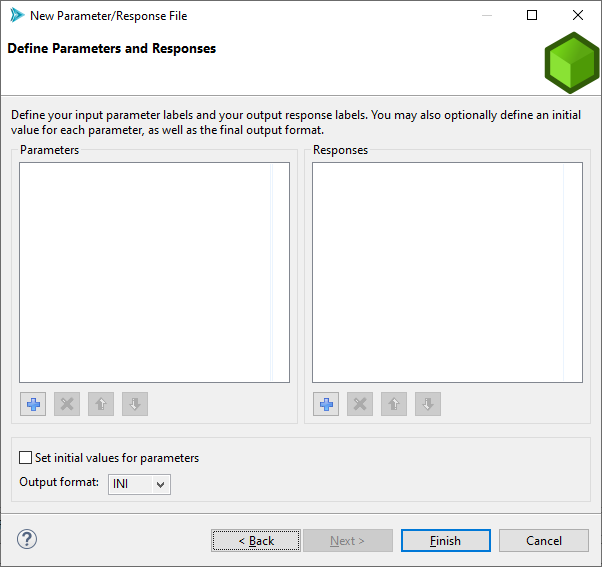

.. _wizards-newparamresponsefile-main:

"""""""""""""""""""""""""""
New Parameter/Response File
"""""""""""""""""""""""""""

The New Parameter/Response File wizard can be a good place to start when you are first thinking about how to define your simulation
model for use with Dakota. Every simulation model must consist of input paramters and output responses. This wizard lets you create
an abstract definition for such a simulation model, and then save it to a specific text format (INI, JSON, or YAML), which can
then be ingested by other parts of Dakota GUI.

There are two ways to access the New Parameter/Response File wizard:

- Go to "File > New > Other", then select "BlackBox > Parameter/Response File" from the available options.
- Alternately, right-click on an existing project, and choose "New > Parameter/response file" from the context menu.

After defining a location and filename for your parameter/response file, you will be presented with the "Define Parameters and Responses" page of the wizard.

   
The Add button (blue plus icon) under either table will let you add a new parameter or response, respectively, while the Delete button
(red X icon) will let you delete parameters/responses, and the Move Up/Move Down buttons (blue arrow icons) will let you re-order the lists
of labels. Parameter/response labels are edited directly in the table by double-clicking on the appropriate row.

You can also check the "Set initial values for parameters" checkbox to define initial values for parameters, and you can set the
final output format using the "Output format" dropdown.

When you are ready to save your file, click on the Finish button in the lower-right corner.