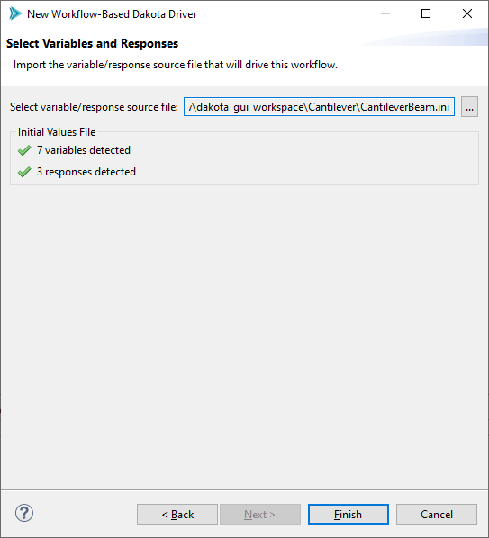

.. _wizards-newworkflowdriver-main:

"""""""""""""""""""""""""
New Workflow-Based Driver
"""""""""""""""""""""""""

The Workflow-Based Dakota Driver wizard creates a :ref:`Dakota analysis driver <couplingtosimulations-main>` that is an :ref:`IWF workflow file <ngw-main>`.  Workflow files
provide you with a great degree of flexibility over how you pass input variables and output responses back and forth between Dakota and an external simulation model, all
without the need to write any driver scripts.

Before beginning this wizard, you will need a file that declares your expected input variables and output responses.  This could be
a :ref:`simple text file containing input parameter values <gui-simulation-models-ini-json-yaml>`, or it could be a Dakota study, if
you already have an appropriate Dakota study on hand.

To launch this wizard, go to File > New > Other.  Then choose Dakota > Workflow-Based Dakota Driver.

On the first page of this wizard, give your workflow file a name and location.

On the second page of this wizard, choose a variable/response source file that will auto-generate this workflow’s inputs and outputs.

Now click Finish.  That was easy!

If you need help building out the driver workflow you just created, :ref:`refer to this tutorial <gui-nestedworkflowtutorial-main>`.
